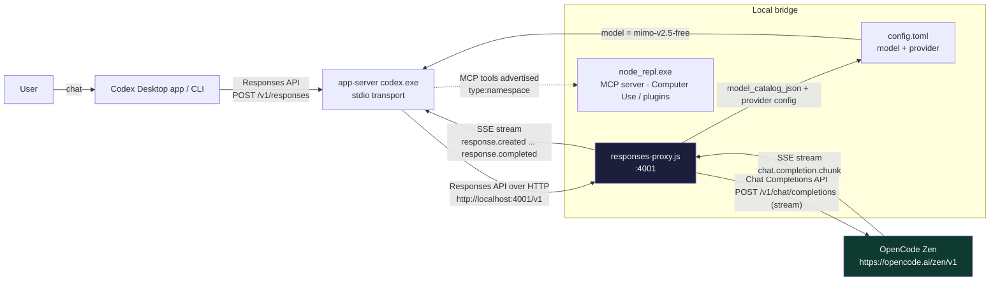

# codex-zen-proxy

Run the **OpenAI Codex CLI / desktop app** on **OpenCode Zen** models (including free ones like `big-pickle`, `mimo-v2.5-free`, `deepseek-v4-flash-free`) through a tiny local translation proxy.

Codex speaks the OpenAI **Responses API**; OpenCode Zen exposes a **Chat Completions** API. This repo contains a ~460-line Node.js proxy that bridges the two on `localhost:4001`, plus a one-command PowerShell installer that recreates the entire working setup.

## Get your OpenCode Zen API key (tutorial)

The installer walks you through this interactively, but here's the whole flow so you know what to expect.

1. **Open the sign-in page**: <https://opencode.ai/auth> (or go to <https://opencode.ai> and click **Zen** → **Get started**).
2. **Sign in** with **GitHub** or **Google**.
3. **Add billing details**: Zen is pay-as-you-go — top up a balance (e.g. $20) with a card, no subscription. It bills per request, zero markup.
4. **Create a key**: in your Zen dashboard go to **API keys** → **Create API key**. Give it a name like `codex-zen-proxy`.
5. **Copy the key** — it starts with `sk-` and looks like `sk-xxxxxxxxxxxxxxxx...`.
6. **Paste it** into the installer when prompted (your input is masked). It is saved only to your Windows **User** environment variable `OPENCODE_ZEN_API_KEY` on this machine.

> Tip: you can also supply the key non-interactively with `-ApiKey sk-xxxx` so the script never asks.

## Setup (one command)

Prerequisites: Windows, PowerShell, [Node.js](https://nodejs.org) >= 16, and an [OpenCode Zen](https://opencode.ai) API key (see above).

```powershell
powershell -ExecutionPolicy Bypass -Command "iex ((irm 'https://raw.githubusercontent.com/marceli1404/codex-zen-proxy/main/setup.ps1').TrimStart([char]0xFEFF))"
```

Or, from a clone:

```powershell
git clone https://github.com/marceli1404/codex-zen-proxy && cd codex-zen-proxy
powershell -ExecutionPolicy Bypass -File setup.ps1
```

The installer is interactive and guided — it shows a step-by-step progress with colored status, a **masked API-key input section** (with a shortcut that opens the key page for you), and a numbered **model picker**. Skip any prompt by passing options up front:

```powershell
powershell -ExecutionPolicy Bypass -File setup.ps1 -ApiKey sk-xxxx -Model big-pickle
# useful options: -Port <int>  -NoStart (configure only)  -Cli (terminal UI)
#                 -Revert (restore original OpenAI Codex)  -RemoveKey (with -Revert)
```

What `setup.ps1` does:

1. Checks Node.js.
2. Installs `responses-proxy.js`, `start-proxy.ps1`, `switch-model.ps1`, and `model-catalog.json` into `%USERPROFILE%\.codex` (respects `CODEX_HOME`).
3. Shows the **API key section**: reuses your saved key if present, or guides you through getting one and prompts with masked input; saves it to the Windows **User** environment.
4. Lets you pick a **model** (numbered menu) and writes it to `config.toml`.
5. Auto-detects the Codex `node_repl.exe` runtime (Computer Use / MCP plugins) and wires it up — including the full `[mcp_servers.node_repl.env]` block, `notify` (turn-ended), and the bundled `openai-bundled` plugins (`browser`, `chrome`, `computer-use`, `visualize`) enabled, mirroring a known-good working device.
6. Backs up any existing `config.toml` and generates a fresh one pointing Codex at `http://localhost:4001/v1`.
7. (Re)starts the proxy and health-checks `http://localhost:4001/health`.
8. Registers a **logon scheduled task** (`CodexZenProxy`) that auto-starts the proxy on every reboot — no need to reinstall after a restart.
9. Shows your **free quota today** as two progress bars (requests + tokens), both in the CLI and in the GUI installer.

Then **fully quit and restart** the Codex desktop app, or test the CLI immediately:

```powershell
codex exec -c model=mimo-v2.5-free -c model_provider=opencode-zen "say hello"
```

Switch models **instantly** (no desktop restart) with the included switcher:

```powershell
# interactive menu
powershell -ExecutionPolicy Bypass -File %USERPROFILE%\.codex\switch-model.ps1
# or directly, non-interactive
powershell -ExecutionPolicy Bypass -File %USERPROFILE%\.codex\switch-model.ps1 -Slug big-pickle
```

It calls `PUT /v1/model?slug=<slug>` on the running proxy (the very next prompt uses the new model) **and** updates `model` in `config.toml` so the setting survives restarts. Free models: `big-pickle`, `mimo-v2.5-free`, `deepseek-v4-flash-free`, `ling-3.0-flash-free`, `nemotron-3-ultra-free`, `north-mini-code-free`, `laguna-s-2.1-free`. You can also edit `model` in `config.toml` directly (takes effect on the next app restart).

## Revert to the original OpenAI Codex app

Want to go back to the normal Codex desktop app / ChatGPT login (no Zen, no proxy)? The installer can undo everything it did:

```powershell
# from a clone:
powershell -ExecutionPolicy Bypass -File setup.ps1 -Revert
# or directly from GitHub:
powershell -ExecutionPolicy Bypass -Command "iex ((irm 'https://raw.githubusercontent.com/marceli1404/codex-zen-proxy/main/setup.ps1').TrimStart([char]0xFEFF)) -Revert"
```

Or click the **"Revert to original"** button in the graphical installer (bottom-left, red).

What `-Revert` does:

1. Stops the proxy on the configured port.
2. Removes the `CodexZenProxy` logon scheduled task and/or HKCU `Run` entry (auto-start).
3. Restores `config.toml` from the pre-install backup it made when you ran setup (newest `.bak-*`).
4. Deletes the bridge files (`responses-proxy.js`, `start-proxy.ps1`, `switch-model.ps1`, `model-catalog.json`).
5. Keeps `OPENCODE_ZEN_API_KEY` in your User environment by default; pass `-RemoveKey` to delete it too.

Then **fully quit and restart** the Codex desktop app — it should use your normal OpenAI / ChatGPT login again. Re-run `setup.ps1` any time to switch back to OpenCode Zen.

> Note: if no `config.toml.bak-*` exists (e.g. setup was never run), revert warns you to restore that file manually. With `CODEX_HOME` overridden, revert still restores files but skips auto-start and proxy cleanup for the default home.

## How it works



The proxy performs three critical translations:

| Direction | Problem | Fix |
|-----------|---------|-----|
| **Outbound tools** | Codex sends MCP servers as `type:"namespace"` tools (`mcp__node_repl` containing `js`, ...) which the upstream Chat Completions API can't represent | Flattened to `<namespace>__<tool>` function tools (e.g. `mcp__node_repl__js`) |
| **Inbound tool calls** | The model returns the flat name, but Codex's router rejects `mcp__node_repl__js` as an `unsupported call` — it expects a `function_call` with `namespace` + `name` fields | Reverse-map the flat name back to `{namespace: "mcp__node_repl", name: "js"}` via a `knownNamespaces` table learned from each request |
| **Streaming** | Codex requires a specific Responses SSE event order; Chat Completions sends `chat.completion.chunk` deltas with tool-call `index` fields | Re-emit `response.created` → `response.output_item.added` → `…delta` → `…done` → `response.completed`; track tool calls per-`index` so parallel calls don't merge |

Also handled: `developer` role → `system`, `input_text` blocks → plain strings, `reasoning` items dropped, `function_call`/`function_call_output` history re-mapped into `tool_calls`/`tool` messages, tool-name dedup on repeated SSE deltas.

## Context / token meter inside Codex

The proxy appends a one-line meter to every assistant response it relays, so you can see your context fill and per-turn + daily usage right in the Codex window:

```
[ctx 12.3K/200K (6%) | in 12.3K | out 480 | today 24.5K tok, 41 req]
```

It also sends spec-compliant `usage` (`input_tokens`, `output_tokens`, `total_tokens`) on the `response.completed` event, so any client that reads usage gets real numbers.

- Context window defaults to `200000` tokens (`CODEX_ZEN_CONTEXT`); the daily figures come from the same per-day tracker behind `/v1/usage`.
- Disable the meter line with `CODEX_ZEN_METER=0` (the `response.completed` `usage` is still emitted).
- Note: the meter line becomes part of the assistant message history, so it costs a few tokens per turn when re-sent.

## Model switching endpoints

| Endpoint | Action |
|----------|--------|
| `GET /v1/model` | Current override + free-model list (`{"override": "big-pickle" | null, freeModels: [...]}`) |
| `PUT /v1/model?slug=<slug>` | Set the override (applies to the **next** prompt, no restart). Unknown slug → `400` with the valid list |
| `DELETE /v1/model` | Clear the override (reverts to the `config.toml` model) |
| `GET /v1/models` | All free models (`object: "list"`) |

The override is a per-request remap inside the proxy (`>> MODEL REMAP: sent -> override` in the log), persisted to `~/.codex/zen-model-override.json`, and cleared on `DELETE`. `switch-model.ps1` is a thin menu wrapper around these endpoints.

## Free quota tracking

OpenCode Zen has **no public quota/balance API**, so the proxy measures your usage itself: it counts every relayed request and its input/output tokens, bucketed per UTC day, and persists them to `~/.codex/zen-usage.json` (atomic write, survives restarts). The installer (CLI + GUI) and `push.ps1` display the result as two progress bars.

- Endpoint: `GET http://localhost:4001/v1/usage` → `{ day, requests, totalTokens, models: {...}, limits: { requests, tokens } }`.
- Daily limits default to `200` requests and `500000` tokens (community-observed free-tier numbers) and reset at `00:00 UTC`.
- Tune the limits with env vars `CODEX_ZEN_REQ_LIMIT` / `CODEX_ZEN_TOKEN_LIMIT`.
- Streaming usage is captured by enabling `stream_options.include_usage` upstream and reading the final chunk.

## Files

| File | Purpose |
|------|---------|
| `responses-proxy.js` | The bridge (Responses API in, Chat Completions SSE out, reverse-translated). Config via env vars: `CODEX_ZEN_PORT` (4001), `CODEX_ZEN_BASE`, `CODEX_ZEN_LOG_DIR` (`~/.codex`), `CODEX_ZEN_DEBUG_FILES=1`, `OPENCODE_ZEN_API_KEY`, `CODEX_ZEN_REQ_LIMIT`, `CODEX_ZEN_TOKEN_LIMIT`, `CODEX_ZEN_METER` (`1`/`0`), `CODEX_ZEN_CONTEXT` (200000) |
| `setup.ps1` | One-command installer described above; also `-Revert` (and GUI "Revert to original" button) to restore the original OpenAI Codex setup |
| `start-proxy.ps1` | Manually launch the proxy (reads the API key from the User environment); also invoked by the logon task. Idempotent — exits 0 if the proxy is already listening |
| `switch-model.ps1` | Menu / one-liner model switcher for the running proxy + config.toml |
| `model-catalog.json` | Minimal Codex model catalog exposing the 7 free Zen models |
| `push.ps1` | Show today's free quota bar, then commit + push this repo |

## Troubleshooting

- **Proxy won't start / health check fails** — read `%USERPROFILE%\.codex\proxy-debug.log`. Check the API key is present: `[Environment]::GetEnvironmentVariable('OPENCODE_ZEN_API_KEY','User')`.
- **Desktop picker doesn't list the free models** — a known upstream client-side allowlist filter strips non-ChatGPT-account models (openai/codex #19694, #32119, #32049, #10867). Not patchable via config; the CLI path works, and setting `model` directly in `config.toml` still routes correctly ("Custom" provider).
- **`js_repl = false` reappears in config.toml** — the app-server rewrites `[features]` from its own state on startup (upstream #28481). Ignore it; node_repl is still advertised as a namespace tool in current builds.
- **`unsupported call: mcp__node_repl__js`** — this was the main bug this proxy fixes. If it reappears, enable `CODEX_ZEN_DEBUG_FILES=1`, reproduce, and check `raw-sse-deltas.log` for the flat tool name, then confirm the `output_item.done` event carries `namespace`.

## Background

Built and battle-tested against OpenAI Codex build `26.730.8199.0` on Windows 11. The desktop app's `app.asar` is write-protected by the MSIX `bindflt` driver, so this proxy is the clean, update-proof integration point: it sits between Codex and the upstream, requiring no app patching. The desktop auto-updates, and the proxy keeps working.

The namespace-tool issue this solves is tracked upstream as openai/codex #31354, #23186, and #24297; the community `codex-ollama-proxy` project inspired the split mapping.
